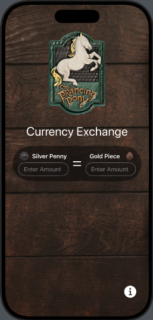
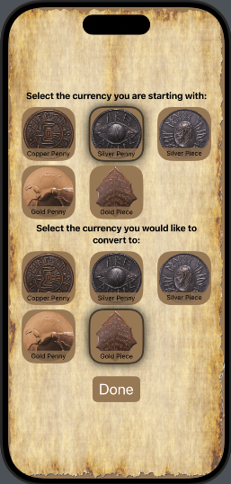
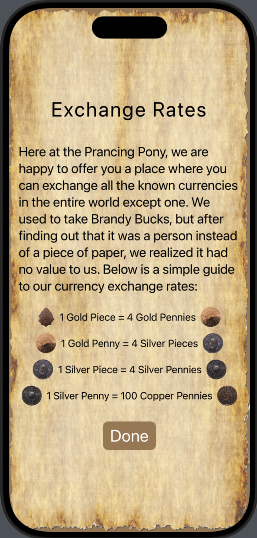

# LOTR Currency Converter



This is a basic iOS application that allows users to convert between different currencies used in the world of J.R.R. Tolkien's *Lord of the Rings*. Whether you're dealing with copper pennies, silver pennies, silver pieces, gold pennies, or gold pieces, this app will help you keep track of your fantasy finances!

## Features

- **Convert between different fictional currencies** used in the Lord of the Rings universe.
- **Simple, user-friendly interface** for seamless conversions.
- **Lightweight and easy to use**, making it accessible for all LOTR fans.




## Getting Started

To get started with this app, clone the repository and open it in Xcode.

```bash
git clone https://github.com/yourusername/LOTR-Currency-Converter.git
